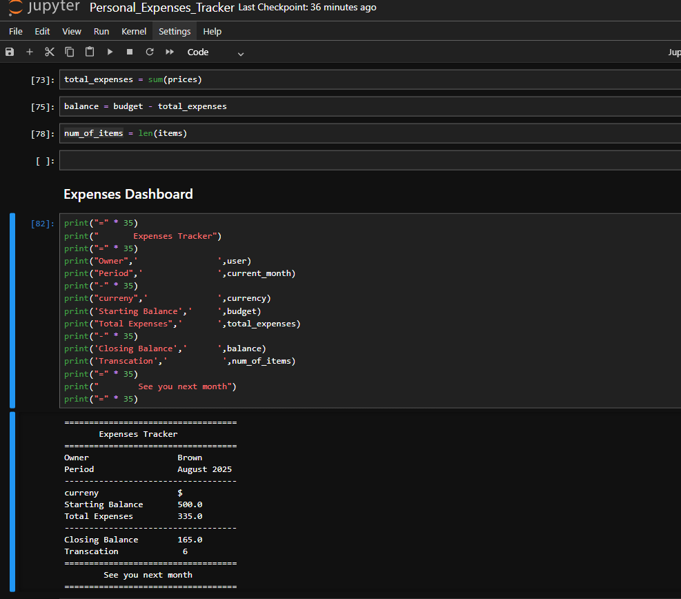

# Personal Expenses Tracker

A simple program that demonstrates the use of **Variables**, **Data Types**, and **Data Structures** through a personal monthly expenses tracker.  

This example tracks income, expenses, and calculates balances for the month of **August 2025**.

---

## 📚 Concepts Covered

### 1. Variables
Variables are used to store information such as:
- Owner name
- Period (month/year)
- Starting balance
- Total expenses
- Number of transactions

```python
owner = "Brown"
period = "August 2025"
starting_balance = 500.0
total_expenses = 335.0
transactions = 6

## 🖥️ Sample Output

](https://github.com/Nduamako/Expenses-Tracker/blob/main/Personal_Expenses_Tracker)
